# Schema

Entity-relationship diagram derived from [`domain-model.md`](./domain-model.md). This is a planning sketch, not a source of truth for the actual SQLModel/Alembic schema — reconcile the two as models are implemented.

```mermaid
erDiagram
    PLANT {
        string slug PK
        string common_name
        string botanical_name
        string description
        string sowing_method
        float spread_cm
        float row_spacing_cm
        float plant_spacing_cm "in-row spacing between individual plants, distinct from row_spacing_cm"
        float height_cm
        string sun_level "full sun | half sun | shadow"
        string soil_type
        string composting_needs
        string fertilizer_needs
        boolean needs_wind_cover
        boolean needs_rain_cover
        boolean sow_indoors "true-or-null, never a derived false"
        boolean sow_direct "true-or-null, never a derived false"
        boolean needs_thinning "true-or-null, never a derived false"
        float water_needs_mm_per_week "depth-rate, e.g. rainfall convention; per-bed volume computed later from this x bed area"
        string growth_habit "free text, e.g. vining, bushy, upright, spreading - for layout-editor footprint rendering"
        int family_id FK "normalized lookup, was a free-text string"
        int genus_id FK "normalized lookup, was a free-text string"
        string parent_plant_slug FK "self-referencing - cultivar's species/parent plant, nullable"
        float min_temperature_c "natural habitat range, not a hardiness zone"
        float max_temperature_c
        int days_to_maturity
        float soil_ph_min
        float soil_ph_max
        boolean is_toxic
        string toxicity_notes
        boolean is_edible
        string edible_parts "array, e.g. fruit, leaves - open-ended"
        boolean succession_enabled
        int succession_interval_days
        int succession_max_sowings
        string life_cycle "annual | biennial | perennial"
        int life_cycle_years "typical productive lifespan, e.g. 7 for raspberries - independent of life_cycle"
    }

    FAMILY {
        int id PK
        string name UK
    }

    GENUS {
        int id PK
        string name UK
        int family_id FK "nullable - a source can give genus without family"
    }

    PLANT_DATA_SOURCE {
        int id PK
        string plant_slug FK
        string source_url
        string attribution
        string notes "for fact-checking"
    }

    SEED_INFO {
        string plant_slug PK, FK
        int seeds_per_gram
        string pretreatment "e.g. cold stratification"
        boolean produces_viable_seeds
        boolean is_f1_hybrid
    }

    PLANT_PERIOD {
        int id PK
        string plant_slug FK
        string period_type FK "references period_type.code - lookup table, not a fixed enum"
        int start_month "1-12, recurs yearly - not a calendar date"
        int end_month "1-12, recurs yearly - not a calendar date"
    }

    PERIOD_TYPE {
        string code PK "e.g. sowing, planting, fertilizing, harvesting"
        string description "e.g. Seed sowing window"
    }

    PLANT_COMPANION {
        string plant_slug FK
        string companion_plant_slug FK
        string relationship "good | bad"
        string mechanism "e.g. pest-deterrent, nitrogen-fixing - open-ended"
        string notes
    }

    PLANT_PEST_INTERACTION {
        int id PK
        string plant_slug FK
        string interaction_type "attracts | repels | vulnerable_to"
        string pest_or_insect "free text, e.g. aphids, ladybugs"
        string notes
    }

    PLANT_GROWING_INFORMATION {
        int id PK
        string plant_slug FK
        string text "long-form, unstructured, e.g. a Project Gutenberg book excerpt"
        string source_url
        string attribution "e.g. book title/author"
        string copyright_status "e.g. public domain, CC BY-SA 4.0, unknown"
        string record_type "raw | consolidated, default raw"
        boolean generic_for_species "true if written generically about the species, not this cultivar"
    }

    PLANT_BEDDING_NEED {
        int id PK
        string plant_slug FK
        string need_type "ground_cover | hilling | staking | ..."
        string notes
    }

    SEED_INVENTORY_ITEM {
        int id PK
        string plant_slug FK
        float quantity_seeds
        float weight_grams
        date acquired_date
        string notes
    }

    GARDEN {
        int id PK
        string name
        jsonb border_geometry "rectangle|polygon, garden-space cm - see Geometry format"
        string climate_zone
        string location
        float orientation_deg "compass bearing, degrees clockwise from true north (0-360), default 0.0 - bed rotation is computed garden-relative to this"
        string notes
    }

    PLANTING_BED {
        int id PK
        string name
        string category "free-text - examples of what a bed can be, not a closed type list"
        jsonb border_geometry "rectangle|polygon, garden-space cm - see Geometry format"
        float height_cm "raised is derived as height_cm > 0, not its own column"
        boolean has_greenhouse
        string soil_type
        string sun_level
        string notes
    }

    PLANTING {
        int id PK
        int bed_id FK "required - open-ground placement uses the auto-created ground bed, not a null bed_id"
        string plant_slug FK
        string placement_type "individual | row | field"
        jsonb geometry "rectangle|polygon, bed-local cm - see Geometry format"
        date planted_date
        date removed_date
        float spacing_cm "per-placement override for row/field placements; null means use the plant's own spread_cm"
    }

    BED_EQUIPMENT {
        int id PK
        int bed_id FK "nullable - null means in inventory, mutually exclusive with garden_id"
        int garden_id FK "nullable - garden-bound placement (rain barrel, pathway, ...), mutually exclusive with bed_id"
        string equipment_type "trellis | drip_line | stake | cold_frame | ... - matched against EQUIPMENT_TYPE.slug by string, not a hard FK"
        jsonb geometry "rectangle|polygon, bed-local cm, null if in inventory - see Geometry format"
        float height_cm
        float water_delivery_lph "irrigation only"
        int zone_id FK "nullable - which IRRIGATION_ZONE this equipment belongs to, if any"
    }

    EQUIPMENT_TYPE {
        int id PK
        string slug UK "matched against BED_EQUIPMENT.equipment_type by string, not a hard FK"
        string name
        string category "bed_bound | garden_bound_decorative | garden_bound_functional"
        jsonb default_geometry "rectangle|polygon template, researched real-world default shape"
        float default_height_cm
    }

    IRRIGATION_ZONE {
        int id PK
        string name
        string notes
    }

    IRRIGATION_PART {
        int id PK
        string name
        string part_type "nozzle | t_junction | connector | valve | hose_segment | ... - open-ended"
        int quantity_on_hand
        string notes
        float connector_size_mm "advisory only, e.g. 13mm standard hose - never blocks a connection"
        float diagram_x "pipe-network diagram canvas position, independent of bed/garden geometry"
        float diagram_y
    }

    IRRIGATION_CONNECTION {
        int id PK
        int from_part_id FK "undirected in practice - names just give each end a distinct column"
        int to_part_id FK
        string notes
    }

    COMPOST_BIN {
        int id PK
        int bed_id FK "unique - enforces 1:1 with PLANTING_BED"
        string fill_state "empty | filling | full | curing"
        date last_turned_date
        date estimated_maturity_date "gardener-set estimate, not derived from last_turned_date"
        string notes
    }

    HARVEST_LOG {
        int id PK
        int planting_id FK "linked to a specific Planting, not just a bed, to build per-crop yield history"
        date harvest_date
        float yield_amount
        string yield_unit "free-text unit (kg, count, bunches, ...) - not a fixed unit column"
        string quality "poor | fair | good | excellent"
        string notes
    }

    COMPOST_FERTILIZATION_LOG {
        int id PK
        int bed_id FK
        date log_date
        string type "compost | fertilizer"
        string product
        string amount
        string notes
    }

    GARDEN_PLAN {
        int id PK
        string season_name
        int year
        string notes
    }

    GARDEN_PLAN_ENTRY {
        int id PK
        int garden_plan_id FK
        string plant_slug FK
        int bed_id FK "optional - not yet assigned"
        int desired_quantity
        string notes
    }

    ACTION {
        int id PK
        string action_type "fertilize | compost | prepare_bed | sow | plant | install_equipment | remove_equipment | harvest | clear | collect_seeds | thin"
        date due_date_start "first day of the matching PlantPeriod window - can't start before"
        date due_date_end "last day of the matching PlantPeriod window - must finish before"
        date completed_date
        string status
        int garden_plan_entry_id FK "optional"
        int bed_id FK "optional"
        string plant_slug FK "optional"
        int equipment_id FK "optional"
        int depends_on_action_id FK "optional, self-referencing - single predecessor, not a general DAG"
        string notes
    }

    PLANT ||--o{ PLANT_DATA_SOURCE : "documented by"
    PLANT ||--o| SEED_INFO : "has"
    PLANT ||--o{ PLANT_PERIOD : "has"
    PERIOD_TYPE ||--o{ PLANT_PERIOD : "classifies"
    PLANT ||--o{ PLANT_BEDDING_NEED : "requires"
    PLANT ||--o{ PLANT_COMPANION : "is subject of"
    PLANT ||--o{ PLANT_COMPANION : "is companion in"
    PLANT ||--o{ PLANT_PEST_INTERACTION : "has"
    PLANT ||--o{ PLANT_GROWING_INFORMATION : "has"
    PLANT ||--o{ SEED_INVENTORY_ITEM : "stocked as"
    PLANT ||--o{ PLANTING : "planted as"
    PLANT ||--o{ GARDEN_PLAN_ENTRY : "planned as"
    PLANT o|--o{ ACTION : "concerns"
    PLANT o|--o{ PLANT : "cultivar of (parent_plant_slug, self-referencing)"
    FAMILY o|--o{ GENUS : "classifies"
    FAMILY o|--o{ PLANT : "classifies"
    GENUS o|--o{ PLANT : "classifies"

    PLANTING_BED ||--o{ PLANTING : "contains"
    PLANTING_BED o|--o{ BED_EQUIPMENT : "hosts"
    PLANTING_BED ||--o{ COMPOST_FERTILIZATION_LOG : "logs"
    PLANTING_BED o|--o{ GARDEN_PLAN_ENTRY : "targeted by"
    PLANTING_BED o|--o{ ACTION : "site of"
    PLANTING_BED o|--o| COMPOST_BIN : "has compost state"
    PLANTING ||--o{ HARVEST_LOG : "yields"
    GARDEN o|--o{ BED_EQUIPMENT : "hosts (garden-bound)"
    IRRIGATION_ZONE o|--o{ BED_EQUIPMENT : "groups"
    IRRIGATION_PART o|--o{ IRRIGATION_CONNECTION : "from"
    IRRIGATION_PART o|--o{ IRRIGATION_CONNECTION : "to"

    GARDEN_PLAN ||--o{ GARDEN_PLAN_ENTRY : "contains"
    GARDEN_PLAN_ENTRY o|--o{ ACTION : "generates"
    BED_EQUIPMENT o|--o{ ACTION : "concerns"
    ACTION o|--o{ ACTION : "depends on (self-referencing)"
```



## Geometry format

All geometry fields (`GARDEN.border_geometry`, `PLANTING_BED.border_geometry`, `PLANTING.geometry`, `BED_EQUIPMENT.geometry`) are `jsonb`, holding a small GeoJSON-flavored shape rather than a `geometry`/`geography` PostGIS column or an SVG string — see the discussion above the diagram for why (single-user, no real spatial queries, direct fit with `react-konva`). All units are centimeters; there is no CRS, just a flat local coordinate plane. Implemented as `backend/app/models/geometry.py`'s `Geometry` Pydantic type (a discriminated union, validated at the API boundary — stored as a raw `dict` at the SQLModel table level, same split the rest of this schema already uses for taxonomy FK-in-table/nested-object-in-API).

**Coordinate spaces** — two, matching how Konva nests groups:
- **Garden space** — `GARDEN.border_geometry` and `PLANTING_BED.border_geometry`. Absolute coordinates on the whole-garden canvas, origin `(0, 0)` at a fixed reference point (e.g. the NW corner of the plot). `PLANTING_BED.orientation` (a separate coarse compass label) was removed 2026-07-20 (#75) once bed rotation became garden-relative (#68) off `GARDEN.orientation_deg` (#69) — a standalone free-text compass field on the bed was redundant once that landed; shade-casting reasoning per root `CLAUDE.md`'s domain notes should derive orientation from `border_geometry`'s `rotation` relative to the garden's own `orientation_deg`, not from a bed-level field.
- **Bed-local space** — `PLANTING.geometry` and `BED_EQUIPMENT.geometry`. Origin `(0, 0)` at the top-left corner of the bed's bounding box, unrotated. The frontend positions each bed's Konva `Group` using `border_geometry` and renders plantings/equipment as children in that group's local coordinates, so it doesn't have to re-derive offsets.

**Shape types** (discriminated union on `type`):

```ts
type Point2D = { x: number; y: number };

type Geometry =
  | { type: "rectangle"; x: number; y: number; width: number; height: number; rotation?: number }
  | { type: "polygon"; points: Point2D[] };
```

`rotation` (degrees, clockwise, default `0`) only applies to `rectangle` — polygon vertices already encode any rotation directly. **Simplified from this doc's original `point`/`line`/`rectangle`/`polygon` four-variant sketch down to just `rectangle`/`polygon`** when actually implemented — one shared discriminated union across every geometry column (garden/bed borders *and* plantings/equipment) rather than a wider variant set only some columns use. `individual` plantings use a small rectangle centered on the placement point rather than a literal `point` type; `row` placements use a `polygon` rather than a `line`. Every geometry-typed column in the real schema accepts exactly `rectangle | polygon`, no exceptions.

**Which type goes where:**

| Field | Allowed types | Notes |
|---|---|---|
| `GARDEN.border_geometry` | `rectangle`, `polygon` | Rectangle is the default shown in the editor; polygon is an explicit user choice via a shape-type toggle. |
| `PLANTING_BED.border_geometry` | `rectangle`, `polygon` | Same rectangle-default/polygon-toggle convention as `GARDEN`. |
| `PLANTING.geometry` | `rectangle`, `polygon` | `individual` → small rectangle (frontend defaults to a 20cm square, `DEFAULT_PLANTING_DIAMETER_CM`); `row`/`field` → `polygon`. |
| `BED_EQUIPMENT.geometry` | `rectangle`, `polygon` | `null` when `bed_id` is `null` (item is in inventory, not placed) or, in practice, whenever the equipment-placement UI hasn't been given a geometry (that tab is form-based, not drag/resize — see the frontend note below). |

**Examples:**

```json
// GARDEN.border_geometry - the garden's own outer boundary, garden space
{ "type": "rectangle", "x": 20, "y": 20, "width": 500, "height": 500, "rotation": 0 }

// PLANTING_BED.border_geometry - a 70x200cm rectangular planter, in garden space
{ "type": "rectangle", "x": 120, "y": 40, "width": 70, "height": 200, "rotation": 0 }

// PLANTING.geometry - a single tomato plant, individually placed, bed-local
{ "type": "rectangle", "x": 5, "y": 20, "width": 20, "height": 20, "rotation": 0 }

// PLANTING.geometry - a row of carrots as a thin polygon, bed-local
{ "type": "polygon", "points": [{ "x": 5, "y": 8 }, { "x": 65, "y": 8 }, { "x": 65, "y": 12 }, { "x": 5, "y": 12 }] }
```

## Modeling decisions worth revisiting

- `PLANT_COMPANION` is a self-referencing join table on `PLANT`, carrying a `relationship` (good/bad) indicator.
- `SEED_INFO` is split into its own 1:1 entity rather than columns on `PLANT`, since it's a distinct data cluster (seeds/gram, pretreatment, F1 status).
- `PLANT_PERIOD` generalizes sowing/planting/fertilizing/harvesting windows into one table with a `period_type` rather than four separate date-range columns — easier to extend, but explicit columns are an alternative. Implemented as `start_month`/`end_month` integers (1-12), not `date`s as originally sketched here — these are species-level windows that recur every year, not one-off events tied to a specific year (that's what `PLANTING`/`ACTION` dates are for).
- `GARDEN_PLAN_ENTRY` is an inferred join between `GARDEN_PLAN` and `PLANT` (optionally a `PLANTING_BED`) — the domain model describes the plan conceptually but doesn't name this table.
- `ACTION` carries four optional FKs (bed/plant/equipment/plan-entry) rather than a polymorphic target — simplest for SQLModel/Alembic, but gets sparse; a generic `target_type`/`target_id` pair is the alternative if nullable FK sprawl becomes a problem.
- `GARDEN_SETTINGS` is left unlinked (singleton config), per the domain model's vague "overarching data" description. **Folded into `GARDEN` when implemented** (below) rather than kept as a separate table — both are singleton/overarching concerns about the same one garden, so a second always-one-row table alongside `GARDEN` would just be a 1:1 split with no independent lifecycle.
- `PLANTING_BED.width_cm` / `length_cm` were dropped in favor of deriving footprint from `border_geometry` (see [Geometry format](#geometry-format)) — `height_cm` stays since it's a true vertical dimension the 2D geometry can't express.
- **`GARDEN`/`PLANTING_BED`/`PLANTING`/`BED_EQUIPMENT` are now implemented** (`backend/app/models/garden.py`, `bed.py`, `planting.py`, `bed_equipment.py`; migrations `create_garden_table`, `generalize_bed_geometry`, `create_planting_table`, `create_bed_equipment_table`). `PLANTING_BED`'s originally-sketched `bed_type` (a closed 5-value enum: `large_planter`/`small_planter`/`berry_row`/`compost_bin`/`fruit_tree`) shipped first as written, then was replaced by free-text `category` once real usage showed those 5 values were only ever meant as *examples* of what a bed could be, not an exhaustive list — the enum and its Postgres type were dropped in the same migration that added `border_geometry`, not layered alongside it.
- **`GARDEN` has no persisted FK relationship to `PLANTING_BED`** (deliberately not drawn as a relationship line in the diagram above) — the only link between them is a one-time convenience default: the API (`GET`/`PUT /api/garden`, singular, get-or-create semantics) auto-creates one ordinary `PLANTING_BED` row matching the `GARDEN`'s own shape the *first* time a garden is created (`category="Ground"`) — the default "plant directly in the garden" surface, so every `PLANTING.bed_id` can stay required/non-nullable instead of needing a nullable garden-space-vs-bed-local branch. That bed is ordinary afterward — the user can reshape, rename, or delete it like any other, and it is not kept in sync with later edits to the garden's own boundary.
- **The `PLANT` cluster is implemented** — `backend/app/models/plant.py` + the `create_plant_tables` migration. All fields except `slug`/`common_name`/`botanical_name` (and each satellite table's own identity/FK columns) are nullable: this table is meant to be bulk-populated from heterogeneous external sources via the ETL in `data/`, which won't have every field for every plant. Don't assume non-null without checking. The JSON import format that feeds the ETL is `data/plant.schema.json` (JSON Schema), designed to map ~1:1 onto this schema - one JSON object per plant, with `seed_info`/`periods`/`companions`/`pest_interactions`/`bedding_needs`/`data_sources` nested as the satellite-table data.
- **`PLANT` gained a second wave of fields** (`add_taxonomy_climate_succession_fields_and_pest_interactions` migration) after cross-referencing candidate data sources against the original field list: `family`/`genus` (taxonomy - the rotation/succession-family domain note had no field to actually key off before this), `min_temperature_c`/`max_temperature_c` (natural habitat range, chosen over a US hardiness zone since it's directly usable for the Belgium climate-adjustment goal), `days_to_maturity`, `soil_ph_min`/`soil_ph_max` (checked 0-14), `is_toxic`/`toxicity_notes`, `is_edible`/`edible_parts`, and `succession_enabled`/`succession_interval_days`/`succession_max_sowings`. `PLANT_COMPANION` gained `mechanism` (open-ended, e.g. "pest-deterrent"). `PLANT_PEST_INTERACTION` is a new table for plant-to-insect relationships (attracts/repels/vulnerable_to) - deliberately separate from `PLANT_COMPANION`, which is plant-to-plant. Explicitly skipped: a "lunar planting affinity" field seen in one candidate source - folk-practice data, low value for this project.
- **`PLANT_GROWING_INFORMATION`** (`add_plant_growing_information` migration) holds long-form, deliberately *unstructured* text - book excerpts (Project Gutenberg has old gardening books with a section per plant) rather than a discrete field. It's raw material for a not-yet-built extraction pass meant to fill the fields nothing structured covers (`composting_needs`, `fertilizer_needs`, `needs_wind_cover`/`needs_rain_cover`, `seed_info.pretreatment`, `bedding_needs` - see `data/CLAUDE.md`'s "Fields still needing a source"). `record_type` (`raw`/`consolidated`) distinguishes a single source's excerpt from a synthesized combination of several. `generic_for_species` flags text written about the species/genus generally (e.g. old books describing "pumpkins" rather than a specific cultivar) rather than this specific cultivar - the text still gets copied into every matching cultivar's own record (see the `PLANT_COMPANION`/matching note in `data/etl/CLAUDE.md` about why cultivars stay separate records), just marked so it isn't mistaken for cultivar-specific advice. No separate "species" entity was introduced for this - keeping it as a flag on the per-cultivar copy was the simpler option and what was asked for.
- **`PLANT_PERIOD.period_type`** (`convert_period_type_to_lookup_table` migration) - was a fixed 4-value Postgres enum (`sowing`/`planting`/`fertilizing`/`harvesting`), now a FK into a new `PERIOD_TYPE` lookup table (`code` PK + `description`), seeded with those same 4 rows. Plant care needs more period types than can be enumerated up front (e.g. pruning, thinning, mulching), and a fixed enum requires a schema migration for every addition - a lookup table lets a new period type be added as a data insert instead. `data/plant.schema.json`'s `period_type` field is correspondingly a plain string now, not a closed JSON Schema enum (same "resolved at import time" caveat as `companions[].companion_slug`).
- **`PLANT.life_cycle`/`life_cycle_years`** (`add_plant_life_cycle` migration) - `life_cycle` classifies annual/biennial/perennial as usual. `life_cycle_years` is a separate, independent nullable field for a perennial's typical *productive* lifespan (e.g. raspberry canes are perennial but a patch is usually renewed after ~7 years) - deliberately not a 4th `life_cycle` value, since "perennial" and "perennial with a known productive span" aren't mutually exclusive categories. Not yet populated by the ETL for any of the 359 already-exported plants - see `data/CLAUDE.md`'s "Fields still needing a source"; `sources/trefle.py`'s `map_record` doesn't currently pull anything duration/life-cycle-related from `main_species`, worth checking against a real cached response before assuming Trefle has (or lacks) this.
- **`PLANT.water_needs` renamed to `water_needs_mm_per_week`** (`plant_water_needs_mm_per_week` migration, #137/#138/#126) - was free text (e.g. `"~1 in/week"`), now a numeric depth-rate (mm/week, e.g. `25.4`), matching the `spread_cm`/`height_cm` unit-in-field-name convention elsewhere on `PLANT`. Chosen over a flat L/week: the source data is a rainfall-style depth-rate with no per-bed area to anchor a volume figure to, and mm/week converts to a real volume 1:1 with `BedEquipment.water_delivery_lph` (L/hour) once a bed's area is known (future irrigation-planning math, #36/#37/#140) - see #126's own design-decision note. `data/plant.schema.json`/`data/plants/*.json` converted to the same field name via `data/etl/convert_water_needs.py` so `import_plants.py`'s generic scalar passthrough picks it up automatically.

**The following bullets were added 2026-07-29 during a routine data-engineer doc-accuracy audit (see root `CLAUDE.md`'s "Keeping the domain model and schema accurate") - the diagram above was already updated to match; these explain why:**

- **`PLANT.family`/`genus` normalized from free-text strings into `FAMILY`/`GENUS` lookup tables** (`family_id`/`genus_id` FKs) - gives referential integrity for taxonomy names and somewhere to hang per-family data later (e.g. rotation cooldown periods), per the domain notes on family-based rotation logic. `GENUS.family_id` is nullable and deliberately never overwritten once set (`app/services/taxonomy.py`'s `find_or_create_genus`) - a source can supply a genus without a family, or one that disagrees with what's on file, and this stays whatever it was first set to until a deliberate cleanup pass reconciles it, not auto-corrected on every import.
- **`PLANT.parent_plant_slug`** (#110/#64) - a nullable self-referencing FK linking a cultivar to its species/parent `Plant` row (e.g. `WHERE parent_plant_slug = 'tomato'` finds all tomato cultivars), rather than a separate `Cultivar` entity or an inheritance/override-resolution layer. Every cultivar stays a full `PLANT` row (matches how the ETL already stores them, see `data/etl/CLAUDE.md`'s cultivar-merge fix) - this column adds the hierarchy on top without duplicating or migrating anything else.
- **`PLANT` gained `plant_spacing_cm`** (#194/#170) - in-row spacing between individual plants, distinct from `row_spacing_cm` (the gap between rows); no structured data source distinguishes the two, so most populated values are a `row_spacing_cm` fallback, not independently sourced (see `data/suggestions.md`'s 2026-07-27 entry).
- **`PLANT` gained `sow_indoors`/`sow_direct`/`needs_thinning`** (#177/#196) - `true`-or-`null` only, never a derived `false`, extracted from unstructured `sowing_method`/`growing_information` text; partial coverage is intentional (matches the existing precedent set by `needs_wind_cover`/`needs_rain_cover`), not a bug.
- **`PLANT` gained `growth_habit`** (free text, e.g. "vining"/"bushy"/"upright"/"spreading", populated by `data/etl/populate_growth_habit.py`) - intended to eventually drive a realistic per-plant footprint in the layout editor instead of a generic circle; no rendering logic consumes it yet.
- **`PLANTING_BED.orientation` and `.is_raised` removed** - `orientation` (#75) was superseded once bed rotation became garden-relative (#68) off `GARDEN.orientation_deg` (#69, added below); `is_raised` is now derived as `height_cm > 0` rather than stored, since the two could otherwise silently disagree.
- **`GARDEN` gained `orientation_deg`** (#69) - compass bearing in degrees clockwise from true north, default `0.0` (north-up, never nullable so consumers don't special-case "unset"). Distinct from the removed `PLANTING_BED.orientation` (a coarse compass label) - this is the numeric value garden-relative bed rotation is computed against.
- **`PLANTING` gained `spacing_cm`** (#150) - a per-placement override (cm) for `row`/`field` placements; `null` means "use the plant's own `spread_cm`". The individual plant instances within a row/field placement are still computed/drawn client-side; this just lets that computation be overridden and remembered per-placement.
- **`BED_EQUIPMENT` gained `garden_id`** (#207, garden-bound placement - a rain barrel, pathway, etc. that belongs to the garden as a whole rather than one bed; mutually exclusive with `bed_id` at the API layer, not a DB constraint) **and `zone_id`** (#36, which shared water source/valve this equipment belongs to, if any - most non-irrigation equipment is never zoned).
- **`EQUIPMENT_TYPE` added** (#206/#207) - a reference lookup for `BED_EQUIPMENT.equipment_type`'s real-world default shape/size and bed-bound vs. garden-bound categorization, seeded from researched `data/equipment_types.json` via `app/scripts/import_equipment_types.py` (same pattern as `PLANT`). Deliberately **not** a hard FK target for `BED_EQUIPMENT.equipment_type` (that column stays free text, matched against `EQUIPMENT_TYPE.slug` by string at read/render time) - an exotic/one-off equipment type with no matching row still works, just without a rendered default.
- **`IRRIGATION_ZONE`/`IRRIGATION_PART`/`IRRIGATION_CONNECTION` added** (#36/#37/#140) - resolves the open question this doc's source, `domain-model.md`, originally posed ("do we want to map out the complete pipe network as well?") - yes: `IRRIGATION_PART` is catalog-level stock (one row per distinct part type, not per physical item - "I have 6 of these"), `IRRIGATION_CONNECTION` is a flat undirected edge list recording which parts physically connect to which, and `IRRIGATION_ZONE` groups `BED_EQUIPMENT` rows sharing a water source/valve. All three use flat FK/edge-list shapes rather than a general graph model, matching this garden's actual scale (a handful of parts/valves), not a arbitrary-topology pipe network.
- **`COMPOST_BIN` added** (#39) - compost-specific state (fill state, last-turned date, estimated maturity) for one of the garden's compost bins, kept as a small satellite 1:1 with `PLANTING_BED` (`bed_id` unique) rather than extending `PLANTING_BED` itself, since `category` is deliberately free-text/open-ended and these fields only ever apply to one bed out of many. `estimated_maturity_date` is a plain gardener-set field, not derived from `last_turned_date` - no single reliable formula exists to compute it from turn history alone.
- **`HARVEST_LOG` added** - not sketched in this doc's original diagram at all (unlike `COMPOST_FERTILIZATION_LOG`); designed from scratch following that table's own pattern (a log row referencing what it's about, a date, free-text notes) plus yield-adjacent fields. Linked via `planting_id` rather than `bed_id`, so a per-crop yield history survives multiple plantings occupying the same bed over time - per root `CLAUDE.md`'s domain note that harvest logs should inform next year's planning.
- **`ACTION.due_date` split into `due_date_start`/`due_date_end`** (#192) - a due *window* derived from the matching `PLANT_PERIOD`'s `start_month`/`end_month`, not a single instant; "what can I pick up right now" is `due_date_start <= today`, ordered by `due_date_end` ascending. A clearing task collapses this to a single day (`due_date_start == due_date_end == PLANTING.removed_date`) since clearing isn't templated off species data. `completed_date` remains separate and independent, recording the actual completion event. `ACTION` also gained `depends_on_action_id` (a single optional self-referencing predecessor, not a general DAG - e.g. sowing shouldn't start before bed prep is done) and a `thin` `action_type` value (#192's own technical analysis - no per-species thinning window exists in the plant data today, so this stays a manually-created task type, never auto-generated).
